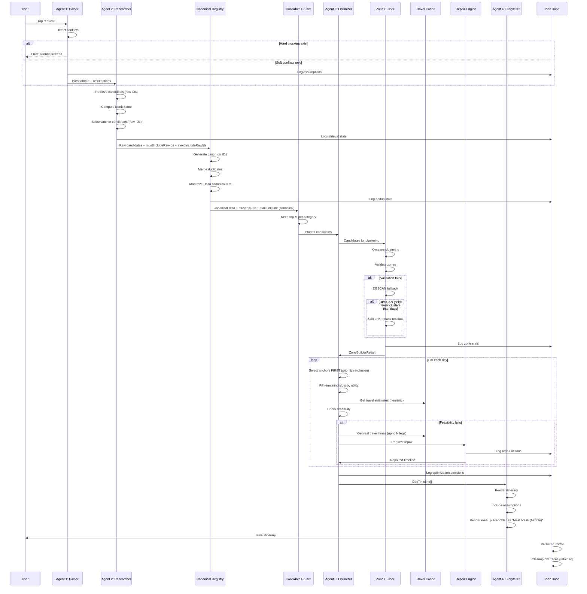

# Design Document: Optimizer v3 Improvements

## Overview

This design document describes the technical architecture for WANDR AI Optimizer v3 improvements. The system enhances the existing 4-agent pipeline (Parser → Researcher → Optimizer → Storyteller) to produce higher-quality itineraries with:

- **Anchor-first scheduling**: Iconic attractions are prioritized for inclusion (not necessarily earliest in day)
- **Robust zone clustering**: K-means with validation and DBSCAN fallback for corridor-like cities
- **Two-tier travel estimation**: Cheap heuristics for planning, real API calls for validation
- **Decoupled meals**: Feature-flagged meal planning with clean type separation
- **Canonical deduplication**: Single source of truth for place identity
- **Soft conflict handling**: Parser continues with defaults instead of blocking
- **PlanTrace observability**: Structured debugging with reason codes

The design maintains backward compatibility with existing interfaces while introducing new capabilities through additive changes.

## Architecture

### High-Level Data Flow

```
┌─────────────────────────────────────────────────────────────────────────────────────┐
│                           OPTIMIZER v3 PIPELINE                                      │
├─────────────────────────────────────────────────────────────────────────────────────┤
│                                                                                      │
│  User Input                                                                          │
│      │                                                                               │
│      ▼                                                                               │
│  ┌─────────────────┐                                                                 │
│  │  Agent 1:       │  hard_blockers[] ──► HALT                                       │
│  │  Parser         │  soft_conflicts[] + assumptions[] ──► Continue                  │
│  └────────┬────────┘                                                                 │
│           │ ParsedInput + assumptions                                                │
│           ▼                                                                          │
│  ┌─────────────────┐                                                                 │
│  │  Agent 2:       │  ──► candidatePool[] (raw IDs)                                  │
│  │  Researcher     │  ──► anchorCandidateRawIds[] (ranked, capped)                   │
│  │                 │  ──► anchorPolicy                                               │
│  │                 │  ──► mustIncludeRawIds[], avoidIncludeRawIds[]                  │
│  └────────┬────────┘                                                                 │
│           │ ResearchOutput (raw IDs)                                                 │
│           ▼                                                                          │
│  ┌─────────────────┐                                                                 │
│  │  Canonical      │  ──► canonicalPlacesById                                        │
│  │  Place Registry │  ──► rawIdToCanonicalId                                         │
│  │                 │  ──► mustInclude[] (canonical), avoidInclude[] (canonical)      │
│  └────────┬────────┘                                                                 │
│           │ CanonicalData                                                            │
│           ▼                                                                          │
│  ┌─────────────────┐                                                                 │
│  │  Candidate      │  ──► prunedCandidates (top M per category)                      │
│  │  Pruner         │                                                                 │
│  └────────┬────────┘                                                                 │
│           │                                                                          │
│           ▼                                                                          │
│  ┌─────────────────┐     ┌──────────────────┐                                        │
│  │  Agent 3:       │────►│  Zone Builder    │                                        │
│  │  Optimizer      │     │  + Validator     │                                        │
│  │                 │◄────│  (K-means/DBSCAN)│                                        │
│  │                 │     └──────────────────┘                                        │
│  │                 │     ┌──────────────────┐                                        │
│  │  Anchor-First   │────►│  Travel Cache    │                                        │
│  │  Selection      │◄────│  (2-tier)        │                                        │
│  │                 │     └──────────────────┘                                        │
│  │                 │     ┌──────────────────┐                                        │
│  │  Feasibility    │────►│  Repair Engine   │                                        │
│  │  Checker        │◄────│  (priority order)│                                        │
│  └────────┬────────┘     └──────────────────┘                                        │
│           │ DayTimeline[] + PlanTrace                                                │
│           ▼                                                                          │
│  ┌─────────────────┐                                                                 │
│  │  Agent 4:       │  ──► Final Itinerary                                            │
│  │  Storyteller    │  ──► assumptions[] displayed                                    │
│  │                 │  ──► meal_placeholder rendered                                  │
│  └─────────────────┘                                                                 │
│                                                                                      │
│  ┌─────────────────┐                                                                 │
│  │  PlanTrace      │  Persisted to runs/<runId>/plan_trace.json                      │
│  │  (Observability)│  Cleanup: retain last planTraceRetentionCount                   │
│  └─────────────────┘                                                                 │
│                                                                                      │
└─────────────────────────────────────────────────────────────────────────────────────┘
```

### Component Interaction Diagram



## Components and Interfaces

### 1. Feature Flags (`lib/config/feature-flags.ts`)

Central configuration for feature toggles.

```typescript
interface FeatureFlags {
  ENABLE_MEALS: boolean;           // Default: false
  ENABLE_REAL_TRAVEL_VALIDATION: boolean;  // Default: true
  ENABLE_DBSCAN_FALLBACK: boolean; // Default: true
}

const DEFAULT_FEATURE_FLAGS: FeatureFlags = {
  ENABLE_MEALS: false,
  ENABLE_REAL_TRAVEL_VALIDATION: true,
  ENABLE_DBSCAN_FALLBACK: true,
};

function getFeatureFlags(): FeatureFlags;
```

### 2. Optimizer Configuration (`lib/config/optimizer-config.ts`)

Extended configuration with all v3 parameters.

```typescript
interface OptimizerV3Config {
  // Existing config
  dayBudgetMinutes: number;
  dayStartTime: number;
  dayEndTime: number;
  pace: 'relaxed' | 'moderate' | 'packed';
  bufferMinutesBetweenSlots: number;
  minBufferMinutes: number;

  // New v3 config
  maxDayDiameterKm: number;
  minAnchorsPerDayCoverage: number;
  maxAnchorsTotalDefault: number;
  topNLegsRealTravelValidation: number;
  timeBucketMinutes: number;
  mealPlaceholderMinutes: number;
  bigRockThresholdMinutes: number;
  anchorReviewCountThreshold: number;
  anchorIconicScoreThreshold: number;
  maxZoneToMinZonePoiRatio: number;
  maxZoneMinutesToMinZoneMinutesRatio: number;
  maxAdditionalPoisOnBigRockDay: number;
  defaultTravelMode: 'driving' | 'walking' | 'transit';
  nearbySwapRadiusKm: number;
  dedupMergeRadiusMeters: number;
  lowUtilityThreshold: number;
  
  // Candidate pruning
  maxCandidatesPerDay: number;      // Default: 30
  maxCandidatePoolTotal: number;    // Default: 200
  
  // DBSCAN config
  dbscanEpsilonKm: number;          // Default: maxDayDiameterKm / 5
  dbscanMinPoints: number;          // Default: 3
}

// Validation rule: minTotalAnchors <= maxAnchorsTotalDefault
// If violated: clamp and log configuration conflict
```

### 3. Anchor Policy (`lib/planning/anchor-policy.ts`)

Defines anchor selection and scheduling rules.

```typescript
interface AnchorPolicy {
  minTotalAnchors: number;
  minAnchorsPerDay: number;
  maxAnchorsPerDay: number;
  diversityTargets: {
    categories: string[];      // e.g., ['landmark', 'museum', 'park']
    minCategoryCoverage: number; // e.g., 0.5 = at least half of categories
  };
}

// Note: AnchorCandidate uses RAW IDs before canonicalization
interface AnchorCandidateRaw {
  rawId: string;              // Provider ID (Google Place ID)
  name: string;
  iconicScore: number;
  reviewCount: number;
  rating: number;
  category: string;
  location: { lat: number; lng: number };
}

// After canonicalization, anchors use canonical IDs
interface AnchorCandidate {
  canonicalId: string;
  rawIds: string[];           // All raw IDs that mapped to this
  name: string;
  iconicScore: number;
  reviewCount: number;
  rating: number;
  category: string;
  location: { lat: number; lng: number };
}

interface AnchorSelectionResult {
  anchors: AnchorCandidateRaw[];   // Ranked, capped at maxAnchorsTotalDefault
  infeasibleAnchors: Array<{
    rawId: string;
    reasonCode: InfeasibilityReasonCode;
  }>;
}

// Uses EnrichedCandidateRaw (pre-canonicalization)
function computeIconicScore(candidate: EnrichedCandidateRaw): number;
function selectAnchors(
  candidates: EnrichedCandidateRaw[],
  policy: AnchorPolicy,
  config: OptimizerV3Config
): AnchorSelectionResult;

/**
 * Curated Top List Provider (optional, not implemented in v3)
 * For v3: anchor eligibility uses reviewCount and iconicScore thresholds only.
 * Future: implement this interface to add editorial curation.
 */
interface CuratedTopListProvider {
  isCuratedTop(rawId: string, city: string): boolean;
}

/**
 * Config Validation:
 * If policy.minTotalAnchors > config.maxAnchorsTotalDefault:
 * - Clamp policy.minTotalAnchors = config.maxAnchorsTotalDefault
 * - Log in PlanTrace.config.conflicts[]
 */
```

### 4. Canonical Place Registry (`lib/planning/canonical-registry.ts`)

Single source of truth for place deduplication.

```typescript
interface CanonicalPlace {
  canonicalId: string;
  name: string;
  normalizedName: string;
  location: { lat: number; lng: number };
  geohash6: string;
  reviewCount: number;
  rating: number;
  categories: string[];
  photoUrls: string[];
  rawIds: string[];  // All raw IDs that mapped to this canonical
}

interface CanonicalRegistryResult {
  /** Keyed by CanonicalPlace.canonicalId only (invariant) */
  canonicalPlacesById: Map<string, CanonicalPlace>;
  rawIdToCanonicalId: Map<string, string>;
  
  // Converted from raw IDs to canonical IDs
  mustInclude: string[];      // Canonical IDs
  avoidInclude: string[];     // Canonical IDs
  anchors: AnchorCandidate[]; // With canonical IDs
  
  // ID mapping failures (for mustInclude/avoidInclude that couldn't be mapped)
  idMappingFailures: Array<{
    rawId: string;
    source: 'mustInclude' | 'avoidInclude';
    reason: 'RAW_ID_NOT_FOUND' | 'FETCH_FAILED';
  }>;
  
  mergeLog: Array<{
    canonicalId: string;
    mergedRawIds: string[];
    reason: 'exact_key' | 'near_duplicate';
  }>;
}

/**
 * Exact Duplicate Detection Rules (deterministic):
 * 1. If rawId matches → same canonical (always, highest priority)
 * 2. Else if dedupKey matches exactly → merge (reason: 'exact_key')
 * 3. Else if within dedupMergeRadiusMeters AND name similarity >= 0.92 (Jaro-Winkler) → merge (reason: 'near_duplicate')
 * 
 * Name similarity threshold: Jaro-Winkler >= 0.92 on normalizedName
 * 
 * Normalization Rules (deterministic):
 * 1. Lower-case
 * 2. Trim + collapse whitespace
 * 3. Strip punctuation (except hyphens in compound names)
 * 4. Remove stopwords: "the", "a", "an", "of", "in", "at"
 * 5. Normalize unicode (NFKD) and remove diacritics
 * 
 * dedupKey composition:
 * dedupKey = `${normalizedName}|${geohash6}|${primaryCategory}`
 */

class CanonicalPlaceRegistry {
  constructor(config: { dedupMergeRadiusMeters: number });
  
  /**
   * ID Mapping Behavior for mustInclude/avoidInclude:
   * 1) If rawId exists in candidates → map to canonical
   * 2) If rawId missing → attempt fetch-by-id (one API call)
   * 3) If fetch fails → log RAW_ID_NOT_FOUND and continue (soft failure)
   */
  register(
    candidates: EnrichedCandidateRaw[],
    anchorCandidatesRaw: AnchorCandidateRaw[],
    mustIncludeRawIds: string[],
    avoidIncludeRawIds: string[]
  ): Promise<CanonicalRegistryResult>;
  
  getCanonical(rawId: string): CanonicalPlace | undefined;
  getCanonicalId(rawId: string): string | undefined;
  
  private generateCanonicalKey(candidate: EnrichedCandidateRaw): string;
  private areNearDuplicates(a: EnrichedCandidateRaw, b: EnrichedCandidateRaw): boolean;
  private mergeIntoCanonical(existing: CanonicalPlace, candidate: EnrichedCandidateRaw): CanonicalPlace;
  private fetchByRawId(rawId: string): Promise<EnrichedCandidateRaw | null>;
}
```

### 5. Zone Builder Result (`lib/planning/zone-builder.ts`)

Explicit interface for zone building output. **Big Rocks are treated as seed points.**

```typescript
interface ZoneBuilderResult {
  zones: Zone[];
  /** zoneId is the index in zones[] after final clustering + rebalancing */
  assignmentByCanonicalId: Record<string, number>;  // canonicalId -> zoneId (index)
  pinnedByCanonicalId: Record<string, 'anchor' | 'big_rock'>;  // Candidates that were pinned
  validation: ZoneValidationResult;
  fallbackUsed: boolean;
  method: 'kmeans' | 'dbscan' | 'graph';
}

/**
 * Zone ID Stability:
 * - zoneId is the index in zones[] after final clustering + rebalancing
 * - Anytime zones reorder (fallback, rebalance), recompute assignmentByCanonicalId
 * - PlanTrace uses these stable post-rebalance zone IDs
 */

/**
 * Zone building strategy for Big Rocks:
 * 1) Identify Big Rocks in candidate pool
 * 2) Create "Big Rock zones" first (one per Big Rock, one per day if possible)
 * 3) Cluster remaining candidates around Big Rock zones or into new zones
 * 4) Big Rocks are pinned and cannot be moved during rebalancing
 * 5) Penalize assignments that pair Big Rock with far-away anchors (>maxDayDiameterKm)
 * 
 * Edge case: bigRocks.length > numDays
 * - Pin top numDays Big Rocks by utility/iconicScore as zone seeds
 * - Remaining Big Rocks marked as 'big_rock_unpinned' in trace
 * - Unpinned Big Rocks treated as normal candidates but subject to Big Rock day limits
 */
function buildZones(
  candidates: EnrichedCandidateCanonical[],
  numDays: number,
  config: OptimizerV3Config
): ZoneBuilderResult;
```

### 6. Zone Validator (`lib/planning/zone-validator.ts`)

Validates zone quality and triggers fallback.

```typescript
interface ZoneValidationResult {
  isValid: boolean;
  violations: Array<{
    zoneId: number;
    type: 'diameter_exceeded' | 'time_infeasible' | 'poi_imbalance' | 'minutes_imbalance';
    value: number;
    threshold: number;
  }>;
  zoneDiameters: Map<number, number>;  // zoneId -> diameter in km
  zoneLoads: Map<number, { poiCount: number; plannedMinutes: number }>;
}

function validateZones(
  zones: Zone[],
  config: OptimizerV3Config
): ZoneValidationResult;

function computeZoneDiameter(zone: Zone): number;  // Max pairwise haversine

function rebalanceZones(
  zones: Zone[],
  anchors: Set<string>,  // Canonical IDs to keep pinned
  config: OptimizerV3Config
): Zone[];
```

### 7. DBSCAN Clustering (`lib/planning/dbscan-clustering.ts`)

Fallback clustering for corridor-like cities.

```typescript
interface DBSCANConfig {
  epsilon: number;      // Max distance between points in cluster (km), default: maxDayDiameterKm / 5
  minPoints: number;    // Min points to form a cluster, default: 3
}

const DEFAULT_DBSCAN_CONFIG: DBSCANConfig = {
  epsilon: 1.6,   // 8km / 5
  minPoints: 3,
};

function dbscanClustering(
  candidates: EnrichedCandidateCanonical[],
  config: DBSCANConfig
): Zone[];

// If DBSCAN yields fewer clusters than days:
// 1. Split largest clusters by K-means
// 2. Or assign residual candidates to nearest cluster
function handleInsufficientClusters(
  zones: Zone[],
  numDays: number,
  candidates: EnrichedCandidateCanonical[]
): Zone[];
```

### 8. Travel Cache (`lib/planning/travel-cache.ts`)

Two-tier travel time estimation with caching.

```typescript
interface TravelCacheKey {
  originGeohash7: string;
  destGeohash7: string;
  mode: 'driving' | 'walking' | 'transit';
  timeBucket: number;  // 0=morning, 1=afternoon, 2=evening
}

interface TravelCacheEntry {
  estimatedMinutes: number;
  realMinutes?: number;
  source: 'heuristic' | 'api';
  timestamp: number;
}

// Reason codes for validation exceptions
enum TravelValidationExceptionCode {
  NOT_ENOUGH_LEGS = 'NOT_ENOUGH_LEGS',
  API_QUOTA_EXCEEDED = 'API_QUOTA_EXCEEDED',
  VALIDATION_DISABLED = 'VALIDATION_DISABLED',
}

class TravelCache {
  constructor(config: { timeBucketMinutes: number });
  
  getHeuristic(origin: Location, dest: Location): number;
  getReal(origin: Location, dest: Location, mode: string): Promise<number>;
  getCached(key: TravelCacheKey): TravelCacheEntry | undefined;
  
  private computeTimeBucket(timeOfDay: number): number;
  private buildCacheKey(origin: Location, dest: Location, mode: string, time: number): TravelCacheKey;
}

interface LegValidationResult {
  legsValidated: number;
  legsRequested: number;
  exception?: TravelValidationExceptionCode;
}

function selectTopLegsForValidation(
  timeline: DayTimeline,
  n: number
): Array<{ from: Location; to: Location; estimatedMinutes: number }>;

// Validates up to N legs (those with largest estimated travel time)
// Returns fewer if day has fewer legs or API quota exceeded
function validateTopLegs(
  timeline: DayTimeline,
  n: number,
  cache: TravelCache,
  trace: PlanTraceBuilder
): Promise<LegValidationResult>;
```

### 9. PlanTrace (`lib/observability/plan-trace.ts`)

Structured observability for debugging.

```typescript
interface PlanTrace {
  runId: string;
  timestamp: string;
  
  config?: {
    conflicts: Array<{
      code: 'ANCHOR_MIN_GT_MAX' | 'INVALID_DAY_WINDOW' | 'NEGATIVE_BUDGET' | 'OTHER';
      message: string;
      field?: string;
      value?: any;
      clampedTo?: any;
    }>;
  };
  
  retrieval: {
    totalCandidates: number;
    afterFilters: number;
    afterDedup: number;
    afterPruning: number;
    anchorsSelected: number;
    anchorsInfeasible: number;
  };
  
  pruning: {
    droppedCount: number;
    droppedByCategory: Record<string, number>;
    droppedByGeohash: Record<string, number>;
    droppedTopExamples: Array<{ id: string; name: string; reasonCode: DropReasonCode }>;
  };
  
  idMapping: {
    missingRawIds: Array<{
      rawId: string;
      source: 'mustInclude' | 'avoidInclude';
      reason: 'RAW_ID_NOT_FOUND' | 'FETCH_FAILED';
    }>;
  };
  
  anchors: {
    /** All IDs are canonical (post-registry merge) */
    selected: Array<{ canonicalId: string; name: string; iconicScore: number }>;
    dropped: Array<{ canonicalId: string; name: string; reasonCode: DropReasonCode }>;
    infeasible: Array<{ canonicalId: string; name: string; reasonCode: InfeasibilityReasonCode }>;
  };
  
  zoning: {
    method: 'kmeans' | 'dbscan' | 'graph';
    zoneCount: number;
    zoneDiameters: Record<number, number>;
    zoneLoads: Record<number, { poiCount: number; plannedMinutes: number }>;
    validationPassed: boolean;
    fallbackUsed: boolean;
    pinnedCandidates: Record<string, 'anchor' | 'big_rock'>;
  };
  
  optimization: {
    perDay: Array<{
      dayIndex: number;
      selected: Array<{ id: string; name: string }>;
      dropped: Array<{ id: string; name: string; reasonCode: DropReasonCode }>;
      mealPlaceholderIncluded: boolean;
      mealPlaceholderOmittedReason?: string;
    }>;
  };
  
  feasibility: {
    violations: Array<{
      dayIndex: number;
      type: FeasibilityViolationType;
      message: string;
    }>;
    repairs: Array<{
      dayIndex: number;
      actionCode: RepairActionCode;
      details: string;
    }>;
    finalStatus: 'pass' | 'fail';
  };
  
  travelMetrics: {
    legsValidated: number;
    legsRequested: number;
    validationExceptions: TravelValidationExceptionCode[];
    /** Keyed by (fromId, toId) for stability across repairs */
    estimatedVsRealDeltas: Array<{
      dayIndex: number;
      fromCanonicalId: string;
      toCanonicalId: string;
      estimated: number;
      real: number;
      delta: number;
    }>;
  };
}

class PlanTraceBuilder {
  constructor(runId: string);
  
  logRetrieval(stats: PlanTrace['retrieval']): void;
  logAnchor(type: 'selected' | 'dropped' | 'infeasible', data: any): void;
  logZoning(stats: PlanTrace['zoning']): void;
  logOptimization(dayIndex: number, selected: any[], dropped: any[], mealPlaceholder: { included: boolean; omittedReason?: string }): void;
  logFeasibility(violation: any): void;
  logRepair(dayIndex: number, action: RepairActionCode, details: string): void;
  logTravelDelta(dayIndex: number, legIndex: number, estimated: number, real: number): void;
  logTravelValidationException(code: TravelValidationExceptionCode): void;
  logConfigConflict(conflict: PlanTrace['config']['conflicts'][number]): void;
  
  build(): PlanTrace;
  persist(): Promise<void>;  // Saves to runs/<runId>/plan_trace.json
  
  /**
   * Cleanup old traces to enforce retention limit.
   * Retention policy: sort by PlanTrace.timestamp (ISO string), keep most recent N.
   * Called after persist() completes.
   */
  static cleanupOldTraces(retentionCount: number): Promise<void>;
}
```

### 10. Parser Soft Conflicts (`lib/agents/agent1-parser.ts` updates)

Extended parser output with conflict categorization.

```typescript
interface ParsedInputV3 extends ParsedInput {
  hard_blockers: Array<{
    field: string;
    message: string;
  }>;
  soft_conflicts: Array<{
    field: string;
    message: string;
    defaultUsed: any;
  }>;
  assumptions: Array<{
    field: string;
    defaultValue: any;
    reason: string;
    humanReadable: string;
  }>;
}
```

### 11. Updated TimelineSlot Type

Extended slot type union for meal placeholders.

```typescript
type TimelineSlotType = 'activity' | 'meal' | 'travel' | 'buffer' | 'meal_placeholder';

/**
 * IMPORTANT: All slot-type switches must include a default handler or explicitly handle meal_placeholder.
 * 
 * In v3 with ENABLE_MEALS=false:
 * - 'meal' is unused (reserved for future ENABLE_MEALS=true)
 * - 'meal_placeholder' is used for flexible meal breaks
 */
interface TimelineSlot {
  type: TimelineSlotType;
  startMin: number;
  endMin: number;
  duration: number;
  candidate?: EnrichedCandidateCanonical;  // Always canonical in v3
  mealSlot?: MealSlot;
  /** Required for all activity slots after the first (filled with heuristic during initial planning) */
  travelFromPrevious?: number;
  // New for meal_placeholder
  placeholderType?: 'breakfast' | 'lunch' | 'dinner';
}

/**
 * Travel Time Invariant:
 * After initial planning pass, every activity slot after the first MUST have travelFromPrevious filled (heuristic).
 * During validation, selected legs get real travel times (both values stored for comparison).
 */
```

### 12. Researcher Output Schema (`lib/agents/agent2-researcher.ts` updates)

Extended research output with anchor data. **Note: Uses RAW IDs, not canonical IDs. Enrichment happens inside Researcher.**

```typescript
// Base interface for enriched candidate (shared fields)
interface EnrichedCandidateBase {
  name: string;
  normalizedName: string;
  location: { lat: number; lng: number };
  category: ActivityCategory;
  categoryConfidence: number;
  durationMinutes: number;
  durationMin: number;
  durationMax: number;
  rating: number;
  reviewCount: number;
  priceLevel?: number;
  photoUrl?: string;
  vicinity?: string;
  googleTypes: string[];
  iconicScore: number;
  utilityScore: number;
  isBigRock: boolean;
  bigRockType?: BigRockType;
  dedupKey: string;
  isGeneric: boolean;
}

// Enriched candidate with raw provider ID (pre-canonicalization)
// Used by: Researcher output, anchor selection
interface EnrichedCandidateRaw extends EnrichedCandidateBase {
  rawId: string;  // Provider ID (Google Place ID)
}

// Enriched candidate with canonical ID (post-canonicalization)
// Used by: Pruner, ZoneBuilder, Optimizer, Repair, Storyteller
interface EnrichedCandidateCanonical extends EnrichedCandidateBase {
  canonicalId: string;
  rawIds: string[];  // All raw IDs that mapped to this canonical (provenance)
}

// Utility Score Definition
// Computed in Researcher, used for pruning + filler selection
// Must be comparable across categories
const UTILITY_SCORE_WEIGHTS = {
  iconic: 0.35,        // iconicScore contribution
  userPrefs: 0.25,     // match to user interests
  diversity: 0.15,     // novelty bonus (different category from already selected)
  quality: 0.15,       // rating + review count signal
  travelPenalty: 0.10, // expected travel time penalty (negative)
};

// utilityScore = w_iconic * iconicScore
//              + w_userPrefs * preferenceMatch
//              + w_diversity * noveltyBonus
//              + w_quality * qualitySignal
//              - w_travel * expectedTravelPenalty

interface ResearchOutputV3 {
  // Enriched candidates (iconicScore + utilityScore computed here)
  enrichedCandidatesRaw: EnrichedCandidateRaw[];
  
  // Legacy format for backward compatibility (derived from enrichedCandidatesRaw)
  candidates: {
    attractions: Candidate[];
    restaurants: Candidate[];  // Empty when ENABLE_MEALS=false
    cafes: Candidate[];        // Empty when ENABLE_MEALS=false (treated as meal-related)
  };
  
  // New v3 fields - all use RAW IDs (pre-canonicalization)
  anchorCandidatesRaw: AnchorCandidateRaw[];  // Ranked, capped at maxAnchorsTotalDefault
  anchorPolicy: AnchorPolicy;
  mustIncludeRawIds: string[];      // Raw provider IDs (from user input + anchors)
  avoidIncludeRawIds: string[];     // Raw provider IDs
  
  // Metadata
  retrievalMetadata: {
    totalRetrieved: number;
    afterFilters: number;
    afterEnrichment: number;
    iconicScoreRange: [number, number];
    utilityScoreRange: [number, number];
  };
}
```

**Enrichment Flow:**
1. Researcher retrieves raw candidates from Google Maps API
2. Researcher enriches candidates (computes iconicScore, utilityScore, duration, category)
3. Researcher selects anchors from enriched candidates
4. Researcher outputs `enrichedCandidatesRaw` + `anchorCandidatesRaw`
5. Canonical Registry receives enriched candidates and maps raw IDs to canonical IDs
6. All downstream components (Pruner, ZoneBuilder, Optimizer) use `EnrichedCandidateCanonical`

### 13. Candidate Pruner (`lib/planning/candidate-pruner.ts`)

Pre-zoning candidate reduction for performance. **Geography-aware to preserve corridor coverage.**

```typescript
interface PrunerConfig {
  maxCandidatesPerDay: number;   // Default: 30
  maxCandidatePoolTotal: number; // Default: 200
  topKPerGeohashCell: number;    // Default: 10
  pruneGeohashPrecision: 6;      // Constant: geohash6 = ~1.2km cells (preserves corridor diversity)
}

interface PrunerResult {
  prunedCandidates: EnrichedCandidateCanonical[];
  droppedCount: number;
  droppedByCategory: Record<string, number>;
  droppedByGeohash: Record<string, number>;
}

/**
 * Pruning strategy:
 * 1) Always keep anchors + mustInclude (never pruned)
 * 2) Group remaining by geohash6 cell and category
 * 3) Keep top-K by utility per group (preserves geographic diversity)
 * 4) Apply global maxCandidatePoolTotal cap
 */
function pruneCandidates(
  candidates: EnrichedCandidateCanonical[],
  numDays: number,
  anchors: Set<string>,      // Canonical IDs to always keep
  mustInclude: Set<string>,  // Canonical IDs to always keep
  config: PrunerConfig
): PrunerResult;
```

### 14. Repair Engine Updates (`lib/validation/repair-engine.ts`)

Priority-ordered repair with reason codes.

```typescript
interface RepairResult {
  success: boolean;
  actionsTaken: Array<{
    actionCode: RepairActionCode;
    dayIndex: number;
    details: string;
  }>;
  repairedTimeline: DayTimeline;
}

const REPAIR_PRIORITY_ORDER: RepairActionCode[] = [
  'REORDER_2OPT',
  'DROP_LOWEST_UTILITY',
  'SWAP_NEARBY',
  'MOVE_TO_ADJACENT_DAY',
  'SHRINK_DURATION',
  'COMPRESS_BUFFERS',
  'RELAX_DIAMETER_THRESHOLD',
];

function repairDay(
  timeline: DayTimeline,
  issue: FeasibilityIssue,
  backupCandidates: EnrichedCandidateCanonical[],
  pinnedSet: Set<string>,  // Canonical IDs: anchors + mustInclude + pinned big rocks
  config: OptimizerV3Config,
  trace: PlanTraceBuilder
): RepairResult;

/**
 * Repair Engine Protection Rules:
 * 1) Anchors cannot be dropped or moved unless infeasible
 * 2) MustInclude cannot be dropped unless infeasible (open hours/hard constraints)
 * 3) Pinned Big Rocks cannot be moved across days unless infeasible
 * 4) All pinned candidates are in pinnedSet and treated uniformly
 */
```

## Data Models

### Reason Code Enums

```typescript
enum DropReasonCode {
  DUPLICATE_CANONICAL = 'DUPLICATE_CANONICAL',
  ANCHOR_POLICY_MAX_REACHED = 'ANCHOR_POLICY_MAX_REACHED',
  DAY_DIAMETER_EXCEEDED = 'DAY_DIAMETER_EXCEEDED',
  TIME_BUDGET_EXCEEDED = 'TIME_BUDGET_EXCEEDED',
  TRAVEL_TIME_EXCEEDED_REAL = 'TRAVEL_TIME_EXCEEDED_REAL',
  OPEN_HOURS_CONFLICT = 'OPEN_HOURS_CONFLICT',
  LOW_UTILITY = 'LOW_UTILITY',
  AVOID_INCLUDE = 'AVOID_INCLUDE',
  ZONE_IMBALANCE = 'ZONE_IMBALANCE',
  BIG_ROCK_DAY_LIMIT = 'BIG_ROCK_DAY_LIMIT',
  PRUNED_LOW_UTILITY = 'PRUNED_LOW_UTILITY',
  PRUNER_CAP_EXCEEDED = 'PRUNER_CAP_EXCEEDED',
  PRUNER_GEOHASH_TOPK = 'PRUNER_GEOHASH_TOPK',
}

enum RepairActionCode {
  REORDER_2OPT = 'REORDER_2OPT',
  DROP_LOWEST_UTILITY = 'DROP_LOWEST_UTILITY',
  SWAP_NEARBY = 'SWAP_NEARBY',
  MOVE_TO_ADJACENT_DAY = 'MOVE_TO_ADJACENT_DAY',
  SHRINK_DURATION = 'SHRINK_DURATION',
  COMPRESS_BUFFERS = 'COMPRESS_BUFFERS',
  RELAX_DIAMETER_THRESHOLD = 'RELAX_DIAMETER_THRESHOLD',
}

enum InfeasibilityReasonCode {
  NO_VALID_OPEN_WINDOW = 'NO_VALID_OPEN_WINDOW',
  EXCEEDS_ALL_DAY_BUDGETS = 'EXCEEDS_ALL_DAY_BUDGETS',
  HARD_CONSTRAINT_VIOLATION = 'HARD_CONSTRAINT_VIOLATION',
  ZONE_ASSIGNMENT_IMPOSSIBLE = 'ZONE_ASSIGNMENT_IMPOSSIBLE',
}

enum TravelValidationExceptionCode {
  NOT_ENOUGH_LEGS = 'NOT_ENOUGH_LEGS',
  API_QUOTA_EXCEEDED = 'API_QUOTA_EXCEEDED',
  VALIDATION_DISABLED = 'VALIDATION_DISABLED',
}

type FeasibilityViolationType =
  | 'TIME_BUDGET_EXCEEDED'
  | 'DAY_DIAMETER_EXCEEDED'
  | 'OPEN_HOURS_CONFLICT'
  | 'TRAVEL_TIME_EXCEEDED_REAL'
  | 'TRAVEL_TIME_EXCEEDED_EST'
  | 'BIG_ROCK_DAY_LIMIT'
  | 'MISSING_ANCHOR'
  | 'MISSING_MEAL';
```

### Iconic Score Weights

```typescript
const ICONIC_SCORE_WEIGHTS = {
  reviewCount: 0.35,
  rating: 0.25,
  categoryPrior: 0.25,
  globalPopularityRank: 0.15,
};

const CATEGORY_PRIORS: Record<string, number> = {
  landmark: 0.9,
  major_museum: 0.85,
  theme_park: 0.85,
  monument: 0.8,
  palace: 0.8,
  fort: 0.75,
  temple: 0.7,
  museum: 0.7,
  zoo: 0.7,
  aquarium: 0.65,
  beach: 0.6,
  park: 0.5,
  garden: 0.5,
  viewpoint: 0.5,
  market: 0.45,
  neighborhood: 0.4,
  unknown: 0.3,
};
```

### Cache Definitions

```typescript
// POI Retrieval Cache (for API failure fallback)
// Key: destination city + country
// Value: last successful retrieval result
// TTL: 24 hours
interface POIRetrievalCache {
  get(destination: string): ResearchOutputV3 | undefined;
  set(destination: string, result: ResearchOutputV3): void;
}

// Travel Time Cache (for real travel time results)
// Key: TravelCacheKey
// Value: TravelCacheEntry
// TTL: 1 hour (traffic varies)
```

### Source of Truth Types (`lib/types/optimizer-v3.ts`)

All v3 types should be exported from a single file to prevent circular imports and ensure raw/canonical split stays clean:

```typescript
// lib/types/optimizer-v3.ts

// Place identity helpers (prevent raw/canonical mixing)
type RawPlaceId = string;        // Google place id
type CanonicalPlaceId = string;  // pid:<raw> or fallback

interface PlaceRef {
  canonicalId: CanonicalPlaceId;
  rawIds: RawPlaceId[];
}

export {
  // Place identity
  RawPlaceId,
  CanonicalPlaceId,
  PlaceRef,
  
  // Base types
  EnrichedCandidateBase,
  EnrichedCandidateRaw,
  EnrichedCandidateCanonical,
  
  // Anchor types
  AnchorCandidateRaw,
  AnchorCandidate,
  AnchorPolicy,
  AnchorSelectionResult,
  
  // Timeline types
  TimelineSlotType,
  TimelineSlot,
  DayTimeline,
  
  // Zone types
  Zone,
  ZoneBuilderResult,
  ZoneValidationResult,
  
  // Canonical registry types
  CanonicalPlace,
  CanonicalRegistryResult,
  
  // Config types
  OptimizerV3Config,
  FeatureFlags,
  PrunerConfig,
  DBSCANConfig,
  
  // Reason code enums
  DropReasonCode,
  RepairActionCode,
  InfeasibilityReasonCode,
  TravelValidationExceptionCode,
  
  // PlanTrace types
  PlanTrace,
};
```


## Correctness Properties

*A property is a characteristic or behavior that should hold true across all valid executions of a system—essentially, a formal statement about what the system should do. Properties serve as the bridge between human-readable specifications and machine-verifiable correctness guarantees.*

### Property 1: Anchor Eligibility

*For any* candidate in the anchors array, that candidate SHALL have `reviewCount >= anchorReviewCountThreshold` OR `iconicScore >= anchorIconicScoreThreshold`.

**Note:** Curated top list is not implemented in v3; eligibility uses thresholds only. Future versions may add `CuratedTopListProvider`.

**Validates: Requirements 1.1**

### Property 2: Anchor Cap and Ranking

*For any* anchor selection result, the anchors array SHALL have length <= `maxAnchorsTotalDefault` AND be sorted by (1) iconicScore descending, (2) reviewCount descending as tie-breaker.

**Validates: Requirements 1.2, 1.3**

### Property 3: Anchor Selection Priority

*For any* scheduled anchor, that anchor SHALL NOT be dropped while any non-anchor with lower utility remains scheduled, unless the anchor is marked infeasible or violates hard constraints.

**Anchor Overflow Policy (when anchors don't all fit):**
When anchors overflow the day budget, drop anchors only in this order:
1. Anchors with `isGeneric=true` (if applicable)
2. Lowest `iconicScore`
3. Lowest `reviewCount` (tiebreak)

Every dropped anchor must be logged as:
- `anchors.dropped` with `DropReasonCode.TIME_BUDGET_EXCEEDED` (or `TRAVEL_TIME_EXCEEDED_REAL` if after validation)
- OR `anchors.infeasible` if it violates a hard constraint

**Validates: Requirements 1.7**

### Property 4: Anchor Coverage Constraints

*For any* itinerary with `minTotalAnchors` specified, either `totalAnchorsScheduled >= minTotalAnchors` OR all unscheduled anchors appear in `infeasibleAnchors` with valid reason codes.

**Validates: Requirements 1.8, 1.9**

### Property 5: Infeasible Anchor Logging

*For any* anchor that cannot be scheduled, the system SHALL emit an entry in `infeasibleAnchors` with a valid `InfeasibilityReasonCode` (one of: NO_VALID_OPEN_WINDOW, EXCEEDS_ALL_DAY_BUDGETS, HARD_CONSTRAINT_VIOLATION, ZONE_ASSIGNMENT_IMPOSSIBLE).

**Validates: Requirements 1.10**

### Property 6: Iconic Score Range

*For any* computed iconicScore, the value SHALL be in the range [0, 1].

**Validates: Requirements 1.11**

### Property 7: Zone Diameter Validation

*For any* zone, the computed diameter (max pairwise haversine distance) SHALL be <= `maxDayDiameterKm` OR the system SHALL log a `RELAX_DIAMETER_THRESHOLD` repair action in PlanTrace.

**Validates: Requirements 2.2, 10.1, 10.2**

### Property 8: Zone POI Count Balance

*For any* set of zones, `max(poiCount) / min(poiCount) <= maxZoneToMinZonePoiRatio` (default 2.0) OR zone validation SHALL fail.

**Validates: Requirements 2.4**

### Property 9: Zone Minutes Balance

*For any* set of zones, `max(plannedMinutes) / min(plannedMinutes) <= maxZoneMinutesToMinZoneMinutesRatio` (default 1.8) OR zone validation SHALL fail.

**Validates: Requirements 2.5**

### Property 10: DBSCAN Fallback Trigger

*For any* zone validation failure, the system SHALL attempt DBSCAN clustering as fallback (when ENABLE_DBSCAN_FALLBACK is true).

**Validates: Requirements 2.6**

### Property 11: Pinned Candidates During Rebalance

*For any* zone rebalancing operation, pinned candidates (anchors + pinned big rocks) SHALL remain in their original zones; only non-pinned POIs may be moved.

**Validates: Requirements 2.7**

### Property 12: Travel Cache Key Format

*For any* cached travel time entry, the cache key SHALL follow format `(origin_geohash_7, dest_geohash_7, mode, timeBucket)` where timeBucket is derived from `timeBucketMinutes`.

**Note:** Cache keys are directional; do not swap origin/dest. Traffic patterns can be directional.

**Validates: Requirements 3.4**

### Property 13: Real Travel Validation Coverage

*For any* final itinerary validation with ENABLE_REAL_TRAVEL_VALIDATION=true, the system SHALL validate `min(topNLegsRealTravelValidation, numberOfLegs)` legs per day (those with largest estimated travel time), logging any exception in PlanTrace.

**Validates: Requirements 3.2, 11.1**

### Property 14: Repair on Travel Failure

*For any* day where real travel time causes feasibility failure, the Repair_Engine SHALL attempt at least one repair action.

**Validates: Requirements 3.5, 11.2**

### Property 15: No Restaurants or Cafes When ENABLE_MEALS=false

*For any* planning run with `ENABLE_MEALS=false`, the output SHALL contain zero restaurant candidates AND zero cafe candidates in retrieval AND zero restaurant/cafe slots in timelines.

**Validates: Requirements 4.2, 4.3**

### Property 16: Meal Placeholder Attempt

*For any* planning run with `ENABLE_MEALS=false`, the system SHALL attempt to include at least one `meal_placeholder` slot per day; if omitted due to feasibility, the reason SHALL be logged in PlanTrace.

**Meal Placeholder Insertion Strategy:**
1. Try to insert lunch placeholder first: target window 12:00–14:00 local day time, duration `mealPlaceholderMinutes`
2. If infeasible (no gap in schedule), try dinner window: 18:00–20:00
3. If still infeasible, omit and log reason in PlanTrace
4. Set `placeholderType` to the attempted meal type (lunch/dinner)

**Validates: Requirements 4.4**

### Property 17: Canonical ID Format

*For any* canonical ID generated by the registry, the ID SHALL be `pid:<provider_place_id>` when rawId exists; otherwise fallback to `normalizedName|city|geohash_6`.

**Note:** `city` is derived from `ParsedInput.destinationCity` (normalized string), not reverse-geocoded per POI.

**Validates: Requirements 5.2**

### Property 18: Duplicate Merge Keeps Best Fields

*For any* merge of duplicate candidates, the resulting canonical record SHALL have: (1) highest reviewCount among merged, (2) union of all photoUrls, (3) union of all categories.

**Validates: Requirements 5.3, 5.4**

### Property 19: Optimizer Uses Canonical IDs

*For any* POI reference in optimizer output (DayTimeline), the ID SHALL be a canonical ID from the registry.

**Validates: Requirements 5.6**

### Property 20: Parser Conflict Categorization

*For any* parser output, detected issues SHALL be categorized into exactly one of: `hard_blockers` (halts pipeline) or `soft_conflicts` (continues with defaults).

**Validates: Requirements 6.1**

### Property 21: Pipeline Halts on Hard Blockers

*For any* parser output with non-empty `hard_blockers`, the pipeline SHALL NOT proceed to the Researcher stage.

**Validates: Requirements 6.2**

### Property 22: Assumptions Populated

*For any* soft conflict resolved with a default, the `assumptions` array SHALL contain an entry with `{field, defaultValue, reason, humanReadable}`.

**Validates: Requirements 6.4**

### Property 23: PlanTrace Created Per Run

*For any* planning run, a PlanTrace object SHALL be created with a unique runId.

**Validates: Requirements 8.1**

### Property 24: PlanTrace Uses Enum Codes

*For any* reason code in PlanTrace (drop reasons, repair actions, infeasibility reasons), the code SHALL be a valid member of the corresponding enum.

**Validates: Requirements 8.10**

### Property 25: No Duplicates in Output

*For any* final itinerary output, no canonical ID SHALL appear more than once (neither within a single day nor across multiple days).

**Scope:** Applies to candidate canonical IDs only (ignore placeholders, travel, buffer slots).

**Meal Placeholder Constraint:** At most one `meal_placeholder` per day (unless explicitly configured otherwise).

**Implementation:** Optimizer maintains `usedCanonicalIds` as a global set across all days. Any candidate whose canonicalId is already in set is dropped with `DropReasonCode.DUPLICATE_CANONICAL`.

**Validates: Requirements 9.2, 9.3, 9.4**

### Property 26: Big Rock Classification

*For any* POI with `durationMinutes >= bigRockThresholdMinutes` (default 180), the POI SHALL be classified as a Big Rock.

**Validates: Requirements 12.1**

### Property 27: Big Rock Day Limits

*For any* day containing a Big Rock, the total number of non-Big-Rock POIs on that day SHALL be <= `maxAdditionalPoisOnBigRockDay` (default 2).

**Validates: Requirements 12.3**

### Property 28: Big Rocks on Separate Days

*For any* itinerary with multiple Big Rocks and sufficient days, each Big Rock SHALL be scheduled on a separate day.

**Validates: Requirements 12.5**

### Property 29: Repair Priority Order

*For any* repair attempt, the Repair_Engine SHALL try actions in this exact order: REORDER_2OPT → DROP_LOWEST_UTILITY → SWAP_NEARBY → MOVE_TO_ADJACENT_DAY → SHRINK_DURATION → COMPRESS_BUFFERS → RELAX_DIAMETER_THRESHOLD.

**Validates: Requirements 13.1**

### Property 30: Pinned Candidates During Repair

*For any* repair operation, pinned candidates (anchors + mustInclude + pinned big rocks) SHALL NOT be dropped or moved unless they are marked as infeasible.

**Validates: Requirements 13.2**

### Property 31: Travel Time Delta Recording

*For any* leg validated with real travel time, the PlanTrace SHALL record both estimated and actual travel times, plus the delta.

**Validates: Requirements 11.3**

### Property 32: Raw to Canonical ID Mapping

*For any* raw ID in mustIncludeRawIds or avoidIncludeRawIds, the system SHALL either produce a canonical ID mapping OR log `RAW_ID_NOT_FOUND` in PlanTrace.idMapping and continue.

**Validates: Requirements 5.5**

## Error Handling

### Parser Errors

| Error Type | Handling | User Impact |
|------------|----------|-------------|
| Hard blocker (invalid destination) | Halt pipeline, return error | User must fix input |
| Hard blocker (impossible dates) | Halt pipeline, return error | User must fix input |
| Soft conflict (ambiguous dates) | Use defaults, log assumption | User sees assumption in output |
| Soft conflict (missing budget) | Use moderate default, log | User sees assumption in output |

### Retrieval Errors

| Error Type | Handling | User Impact |
|------------|----------|-------------|
| Google Maps API failure | Retry 3x, then fallback to POI retrieval cache | Degraded results, logged |
| Zero candidates returned | Return error with suggestion | User prompted to broaden search |
| Travel API quota exceeded | Use heuristic travel times, log exception | Slightly less accurate times |

### Optimization Errors

| Error Type | Handling | User Impact |
|------------|----------|-------------|
| Zone validation failure | DBSCAN fallback | Transparent, logged in trace |
| DBSCAN yields too few clusters | Split or K-means residual | Transparent, logged |
| Feasibility failure | Repair engine attempts fixes | May have relaxed constraints |
| All repairs fail | Return best-effort itinerary | Warning in output |
| Anchor infeasible | Log reason, continue without | User informed of dropped anchor |
| Meal placeholder omitted | Log reason in PlanTrace | Day may lack meal break |

### Storage Errors

| Error Type | Handling | User Impact |
|------------|----------|-------------|
| PlanTrace write failure | Log error, continue | Debugging data lost |
| Trace retention cleanup failure | Log error, continue | Old traces may accumulate |

## Testing Strategy

### Unit Tests

Unit tests focus on specific examples and edge cases:

1. **Anchor Selection**
   - Test tie-break ordering with equal iconicScores
   - Test cap enforcement at exactly maxAnchorsTotalDefault
   - Test empty candidate list handling
   - Test config conflict: minTotalAnchors > maxAnchorsTotalDefault

2. **Canonical Registry**
   - Test exact duplicate detection
   - Test near-duplicate merge at boundary (exactly 300m)
   - Test merge field selection (highest reviewCount wins)
   - Test raw ID to canonical ID mapping

3. **Zone Validation**
   - Test diameter at exactly maxDayDiameterKm
   - Test ratio at exactly 2.0 threshold
   - Test single-zone edge case
   - Test DBSCAN fallback trigger

4. **Parser Conflicts**
   - Test specific hard blocker scenarios
   - Test specific soft conflict scenarios
   - Test assumption formatting

5. **Travel Cache**
   - Test cache key generation
   - Test time bucket boundaries
   - Test cache hit/miss behavior
   - Test quota exceeded fallback

6. **Meal Placeholder**
   - Test placeholder insertion when ENABLE_MEALS=false
   - Test placeholder omission logging

### Property-Based Tests

Property tests verify universal properties across randomized inputs. Each test runs minimum 100 iterations.

**Testing Framework**: Use `fast-check` for TypeScript property-based testing.

1. **Feature: optimizer-v3-improvements, Property 1: Anchor Eligibility**
   - Generate random candidates with varying reviewCount and iconicScore
   - Verify all selected anchors meet eligibility criteria

2. **Feature: optimizer-v3-improvements, Property 2: Anchor Cap and Ranking**
   - Generate more candidates than cap
   - Verify count <= cap and correct sort order

3. **Feature: optimizer-v3-improvements, Property 6: Iconic Score Range**
   - Generate random candidate attributes
   - Verify computed score is in [0, 1]

4. **Feature: optimizer-v3-improvements, Property 7: Zone Diameter Validation**
   - Generate random POI locations
   - Verify diameter computation and validation

5. **Feature: optimizer-v3-improvements, Property 8: Zone POI Count Balance**
   - Generate zones with varying POI counts
   - Verify ratio check

6. **Feature: optimizer-v3-improvements, Property 17: Canonical ID Format**
   - Generate random candidate data
   - Verify canonical ID follows format

7. **Feature: optimizer-v3-improvements, Property 18: Duplicate Merge Keeps Best Fields**
   - Generate duplicate candidates with different field values
   - Verify merge keeps best of each field

8. **Feature: optimizer-v3-improvements, Property 25: No Duplicates in Output**
   - Generate random itineraries
   - Verify no canonical ID appears twice

9. **Feature: optimizer-v3-improvements, Property 26: Big Rock Classification**
   - Generate POIs with varying durations
   - Verify classification threshold

10. **Feature: optimizer-v3-improvements, Property 29: Repair Priority Order**
    - Generate failing timelines
    - Verify repair actions follow priority order

11. **Feature: optimizer-v3-improvements, Property 30: Pinned Candidates Protected in Repair**
    - Generate random failing timelines
    - Generate pinnedSet (anchors + mustInclude + pinned big rocks)
    - Run repairDay
    - Assert that any pinned candidate scheduled remains scheduled in the same day unless marked infeasible

12. **Feature: optimizer-v3-improvements, Property 32: Raw to Canonical ID Mapping**
    - Generate raw IDs and candidates
    - Verify all raw IDs map to canonical IDs or log RAW_ID_NOT_FOUND

### Integration Tests

1. **End-to-End Pipeline**
   - Test full flow from user input to final itinerary
   - Verify PlanTrace is created and persisted
   - Verify trace cleanup after retention limit

2. **Feature Flag Behavior**
   - Test ENABLE_MEALS=false produces no restaurants/cafes
   - Test ENABLE_MEALS=true (when implemented) includes restaurants

3. **Fallback Scenarios**
   - Test K-means → DBSCAN fallback
   - Test API → heuristic fallback on quota exceeded
   - Test POI retrieval cache fallback on API failure

4. **Raw to Canonical Flow**
   - Test mustIncludeRawIds → mustInclude conversion
   - Test avoidIncludeRawIds → avoidInclude conversion
   - Test anchor raw IDs → canonical anchor IDs
